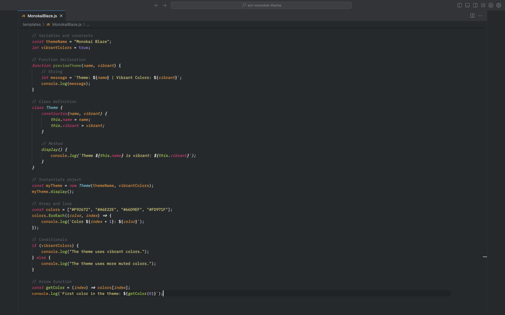

# Monokai Blaze

Monokai Blaze is a vibrant, high-contrast theme inspired by the classic Monokai color scheme, with influences from the KTRZ Monokai theme. Designed for developers who want a bold and energetic look in their coding environment, Monokai Blaze enhances code readability with its vivid colors and clear differentiation between syntax elements

## Installation

### Via Visual Studio Code

1. Open VSCode.
2. Go to the Extensions tab (`Ctrl+Shift+X`).
3. Search for `Theme Name`.
4. Click **Install**.

### Manually

1. Download the theme repository.
2. Extract the contents to your VSCode extensions folder:
   - **Windows:** `%USERPROFILE%\.vscode\extensions`
   - **macOS/Linux:** `~/.vscode/extensions`
3. Restart VSCode and select the theme from `Preferences > Color Theme`.

## Language Support

Monokai Blaze has been tested and offers full support for a wide range of programming languages and file types. The theme ensures vibrant syntax highlighting and clear differentiation for:

- JavaScript
- PHP
- Python
- Java
- C++
- HTML
- CSS

